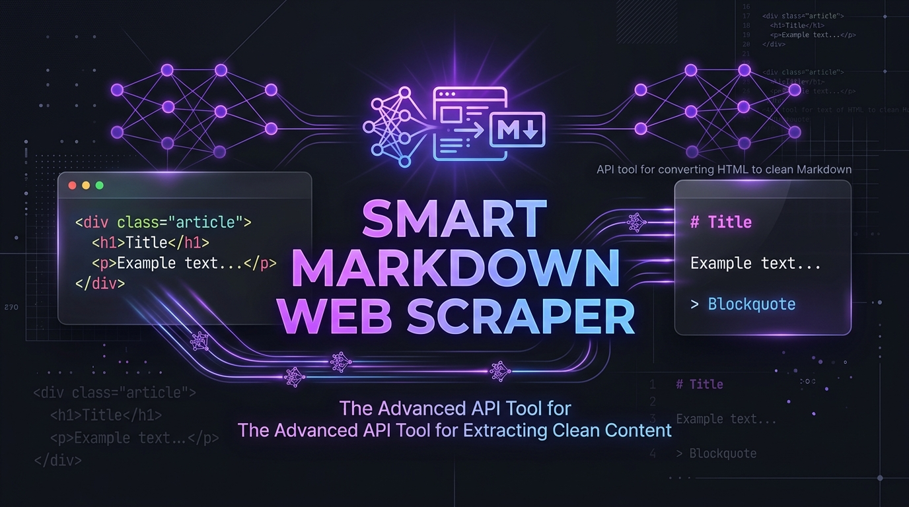

# 🚀 Smart Markdown Web Scraper API - Growth & Ecosystem Hub

> Official project repository for **Smart Markdown Web Scraper API** hosted on [RapidAPI](https://rapidapi.com/modialmadih/api/smart-markdown-web-scraper).
> Includes SDKs, framework integrations, Chrome Extension, interactive landing page, and full marketing growth kits.



---

## 📂 Repository Structure

```
scraper-api/
├── README.md                      # Primary project Hub documentation
├── landing-page/                  # Interactive Web Playground & Marketing Site
│   ├── index.html
│   ├── style.css
│   └── app.js
├── sdks/                          # Official Client Libraries
│   ├── python/                    # Python SDK (`smart_markdown_scraper.py`)
│   └── nodejs/                    # Node.js SDK (`index.js`)
├── integrations/                  # AI Framework Connectors
│   └── langchain_loader.py        # LangChain Document Loader integration
├── cli/                           # Command Line Interface Tool
│   └── smart_md.py                # Terminal tool (`smart-md`)
├── chrome-extension/              # Browser Extension (Manifest V3)
│   ├── manifest.json              # Extension manifest
│   ├── popup.html                 # Popup interface
│   └── popup.js                   # API caller & clipboard logic
└── marketing/                     # Growth & Marketing Campaign Kits
    ├── launch_kit_phase1.md       # Dev.to articles, Reddit, HN & X threads
    ├── outreach_kit_phase2.md     # Cold email sequence & CrewAI tutorials
    └── marketing_banner.jpg       # High-res marketing visual asset
```

---

## 🚀 Quick Usage Summaries

### 1. Python SDK (`sdks/python/`)
```python
from sdks.python.smart_markdown_scraper import SmartMarkdownScraper

client = SmartMarkdownScraper(rapidapi_key="YOUR_RAPIDAPI_KEY")
res = client.scrape_url("https://news.ycombinator.com")
print(res["markdown"])
```

### 2. Command Line Tool (`cli/`)
```bash
python cli/smart_md.py https://techcrunch.com --key YOUR_RAPIDAPI_KEY -o output.md
```

### 3. LangChain Vector Loader (`integrations/`)
```python
from integrations.langchain_loader import SmartMarkdownWebLoader

loader = SmartMarkdownWebLoader(urls=["https://example.com"], rapidapi_key="YOUR_KEY")
docs = loader.load()
```

### 4. Interactive Demo Landing Page (`landing-page/`)
Deploy the contents of `landing-page/` to Vercel, Netlify, or GitHub Pages to provide an interactive playground that converts users to your RapidAPI subscription plans.

---

## 🔗 Key Links
- **RapidAPI Hub Page**: [https://rapidapi.com/modialmadih/api/smart-markdown-web-scraper](https://rapidapi.com/modialmadih/api/smart-markdown-web-scraper)
- **Phase 1 Launch Kit**: [`marketing/launch_kit_phase1.md`](marketing/launch_kit_phase1.md)
- **Phase 2 Outreach Kit**: [`marketing/outreach_kit_phase2.md`](marketing/outreach_kit_phase2.md)
